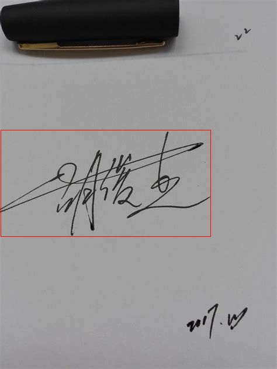

# Py
## 1.Introduce

python+opencv实现的手写签名提取demo,快速预览效果.


## 2.Step

<div>
    
    
    
    
    
    
    
    
    
    
    
    
    
    
</div>

# Cpp
## 1.Introduce

cpp+opencv将快速demo实现为部署版本.

## 2.Run

```sh
cd signature-processing-cpp
./run.sh
```
